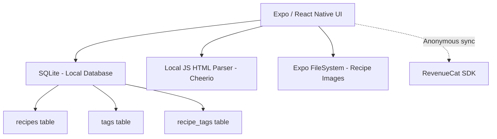

# ChefStash Architecture

**Document:** ARCHITECTURE.md  
**Product:** ChefStash  
**Publisher:** Heldig Lab  

## Architectural Principles & Competitive Edge

- **Strictly No Backend:** The primary feature (parsing recipes from URLs) is often done via a backend proxy in other apps. ChefStash does this *entirely on-device* by fetching the HTML directly via React Native's `fetch` and parsing the DOM locally.
- **Cooking Mode:** Relies on Expo's `KeepAwake` module to prevent the screen from dimming when the user has flour on their hands.
- **One Price Forever:** A $19.99 one-time non-consumable purchase. No subscriptions.

## System Context

## High-Level Component Model

### Client Layer
- **Zustand:** Global state for the active recipe, crossed-off ingredients, and premium status.
- **SQLite (expo-sqlite):** Stores the extracted recipe text, yields, and times.
- **Local Parsing Engine:** A utility file that searches the fetched HTML for `application/ld+json` blocks containing `@type: "Recipe"` to perfectly extract structured data without brittle regex scraping.

### RevenueCat Integration

**SDK:** `react-native-purchases` (RevenueCat React Native SDK)
**Authentication:** Anonymous App User IDs (no account creation required)

#### Product Configuration

| Platform | Product ID | Type | Price |
|----------|-----------|------|-------|
| iOS | `chefstash_premium` | Non-Consumable | $19.99 |
| Android | `chefstash_premium` | Non-Consumable | $19.99 |

#### Entitlements

| Entitlement | Grants Access To |
|------------|-----------------|
| `premium` | Unlimited recipes (free tier limited to 10), custom categorizing (tags), photo attachments for recipe steps |

#### Implementation Flow

1. **App Launch:** Initialize RevenueCat SDK with anonymous user ID. Check entitlement status from cache.
2. **Paywall Display:** Show paywall when user hits free-tier limit. Fetch offerings from RevenueCat (falls back to cached offerings if offline).
3. **Purchase:** Call `purchasePackage()`. RevenueCat handles receipt validation with Apple/Google servers.
4. **Verification:** On success, RevenueCat updates entitlement. App checks `customerInfo.entitlements.active['premium']`.
5. **Restore:** "Restore Purchases" button calls `restorePurchases()`. Essential for users reinstalling or switching devices.
6. **Offline Fallback:** RevenueCat caches entitlement status locally. Premium access persists offline after initial verification. Cache TTL: 25 hours (RevenueCat default). If cache expires while offline, maintain last-known premium status until next successful server check.

#### Error Handling

- **Purchase cancelled:** No action. Return to paywall.
- **Purchase failed:** Show "Purchase couldn't be completed. Please try again." Do not retry automatically.
- **Network error during restore:** Show "Couldn't reach the App Store. Check your connection and try again."
- **Receipt validation failed:** Log error. Show generic "Something went wrong" message. Do not grant premium.

### The "No Backend" Reality
- Cross-device sync relies entirely on the user's OS-level backups or the manual JSON Export/Import feature. We do not host user recipes.