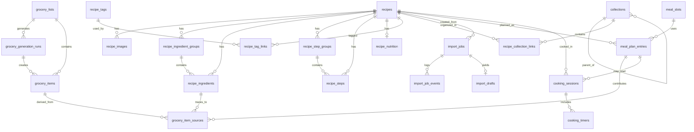
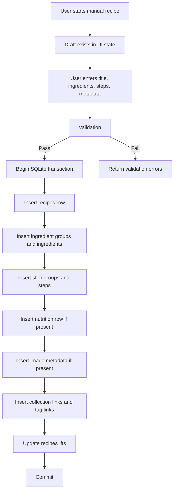
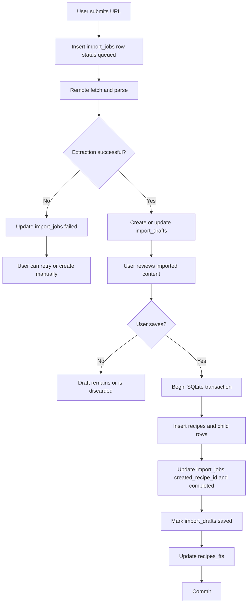
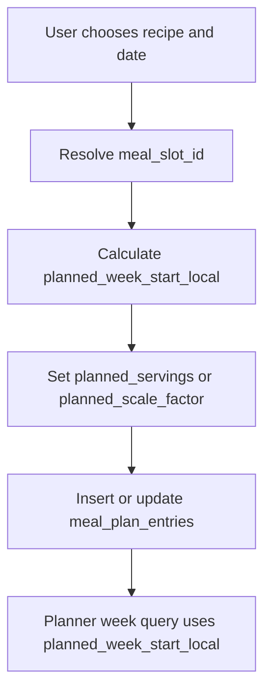
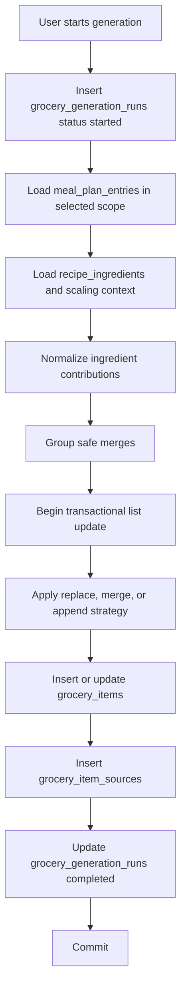
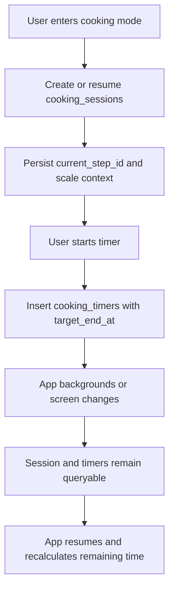

# Recipe Manager & Meal Planner Data Model
## Document Control
| Field | Value |
| --- | --- |
| Document | `DATA-MODEL.md` |
| Product | Recipe Manager & Meal Planner |
| Scope | SQLite schema, entity relationships, migrations, indexes, data flow diagrams |
| Primary Platforms | iOS and Android via React Native / Expo |
| Local Persistence Engine | SQLite |
| Premium Platform Dependency | RevenueCat entitlement state cached locally |
| Current Commercial Offer | $9.99 one-time purchase |
| Status | Draft |
| Related Documents | `docs/SPEC.md`, `docs/REQUIREMENTS.md`, `docs/NFR.md` |
## Purpose
This document defines the production data model for the Recipe Manager & Meal Planner app. It describes how user data is persisted locally, how entities relate to one another, how the schema evolves over time, and how the application should structure queries and write flows so the product remains reliable, fast, and understandable.
This document is intended to support:
- application architecture and persistence implementation,
- QA validation of data integrity,
- migration planning,
- performance tuning,
- offline-first behavior,
- privacy review for local and remote data handling,
- and future feature expansion without breaking existing content.
## Scope
This document covers:
- SQLite schema design for production app data,
- table-by-table entity definitions,
- column semantics and constraints,
- entity relationships and cardinality,
- foreign key behavior,
- soft-delete and archive strategy where relevant,
- index design and query optimization,
- migration versioning and rollout rules,
- data normalization and denormalization decisions,
- FTS search strategy,
- file-storage integration for recipe photos,
- meal plan and grocery generation persistence,
- cooking session and timer persistence,
- and data flow diagrams for the core feature loops.
This document does not define:
- visual UI behavior in detail,
- test case execution steps,
- release management processes outside migration handling,
- or API contracts beyond the minimum local data shape needed to store results.
## Design Goals
The data model must support the product defined in `docs/SPEC.md`, the functional behavior in `docs/REQUIREMENTS.md`, and the quality constraints in `docs/NFR.md`.
The schema is designed to satisfy the following goals:
- Local-first storage for recipes, plans, grocery lists, and settings.
- Fast read performance for common mobile interactions.
- Safe writes for frequently interrupted user workflows.
- Structured storage that supports editing, scaling, grocery generation, and cooking mode.
- Minimal duplication of source-of-truth recipe content.
- Explicit traceability between meal plan entries, grocery items, and recipe ingredients.
- Privacy-conscious local persistence that avoids unnecessary sensitive payload storage.
- Migration safety across app updates.
- Storage efficiency for large libraries, including at least 5,000 recipes.
## Data Modeling Principles
### 1. Local Database Is the Primary Source of Truth
The app does not require account creation for core use. The authoritative source of truth for recipes, collections, meal plans, grocery lists, settings, and recognized premium state on-device is SQLite.
Remote systems may contribute data or state:
- AI import processing may provide structured extraction results.
- RevenueCat may provide entitlement status.
- OS services may provide image assets, notification delivery, and share intents.
However, once data is accepted into the app, the persisted local representation is the authoritative user-facing record.
### 2. Structured Records Over Raw Clips
Recipes must not be stored only as freeform blobs of imported HTML or unparsed notes. The schema preserves both:
- normalized structured fields for application behavior,
- and source text fields where needed for fidelity and user trust.
This is especially important for ingredients and instructions because the app must support:
- editing,
- scaling,
- grocery generation,
- step-by-step cooking mode,
- and display of original wording when structured parsing is incomplete.
### 3. Separate Durable Domain Data from Ephemeral Operational Data
The schema distinguishes between:
- durable user content such as recipes, collections, and meal plans,
- operational state such as import jobs and active cooking sessions,
- and derived data such as grocery generation runs.
Durable data should survive app relaunches and upgrades. Ephemeral or derived data may be rebuilt or expired, but when it affects user-visible continuity it must still persist long enough for stable behavior.
### 4. Preserve User Intent
When the user edits imported data, manually adjusts grocery items, or plans a scaled recipe instance, the persisted model must preserve:
- the original baseline,
- the user’s override,
- and enough metadata to explain how the current state came to be.
### 5. Avoid Destructive Implicit Updates
Regeneration and synchronization flows must not silently overwrite user work. The schema therefore captures:
- generation run records,
- manual override flags,
- source references for generated grocery items,
- and local entitlement timestamps.
### 6. Favor Numeric Ordering Keys Over Textual Guesswork
Entities that require stable ordering, such as recipe steps, ingredient groups, collections, or meal slots, use explicit order keys rather than relying on name sort alone.
### 7. Store Photos as Files, Not SQLite Blobs
Recipe photos can materially increase storage size. To preserve database performance and reduce backup or migration risk, photos are stored in the app sandbox filesystem, with metadata and canonical file paths stored in SQLite.
### 8. Soft Delete Only Where It Prevents User-Harm or Migration Risk
The app is not a collaborative sync product with audit requirements. Therefore, permanent deletion is allowed for many entities after confirmation. Soft-delete patterns are used selectively where they improve safety or recoverability:
- grocery item completion and generation history remain as state, not deletion,
- recipe archiving is modeled separately from deletion,
- import artifacts may expire,
- and timer/session records may be retained only for continuity windows.
## SQLite Conventions
### Database Engine Assumptions
- SQLite version should support foreign keys, partial indexes, common table expressions, generated columns if desired, and FTS5.
- `PRAGMA foreign_keys = ON` must be enabled on every connection.
- `PRAGMA journal_mode = WAL` should be used in production for concurrency and crash resilience.
- `PRAGMA synchronous = NORMAL` is acceptable for routine mobile usage if validated against durability goals; `FULL` may be considered for critical write phases.
- `PRAGMA temp_store = MEMORY` is acceptable where memory testing confirms no regression.
- `PRAGMA busy_timeout` should be configured to avoid transient lock failures during back-to-back writes from UI and background tasks.
### Identifier Strategy
All application tables use a text primary key `id` rather than integer autoincrement IDs.
Rationale:
- IDs can be generated client-side before persistence.
- IDs remain stable across import, duplication, draft save, and future sync/export scenarios.
- String IDs avoid table-rowid coupling in app logic.
Recommended format:
- ULID or UUIDv7-like sortable text identifier.
Benefits:
- preserves uniqueness,
- sorts approximately by creation time when needed,
- and works well for offline generation.
### Timestamp Strategy
All persisted timestamps use UTC ISO 8601 strings in full precision when possible, for example:
- `2026-03-29T18:42:11.482Z`
Rules:
- Store machine timestamps in UTC.
- Derive display-time locale formatting in the application layer.
- Use explicit local-date fields where calendar semantics matter, such as meal plan dates.
- Never rely on device-local timezone offsets for durable comparison logic.
### Boolean Strategy
SQLite does not have a native boolean type. The schema uses `INTEGER NOT NULL DEFAULT 0` for boolean fields, constrained to `0` or `1` where appropriate.
### Enumeration Strategy
Small controlled enums are stored as `TEXT` columns with `CHECK` constraints when the allowed set is stable enough for schema enforcement.
Examples:
- `theme_mode`
- `import_status`
- `grocery_item_origin`
- `timer_status`
### Text Normalization Strategy
The app stores both:
- user-facing original text,
- and normalized helper fields for search, duplicate detection, or grouping where needed.
Normalization should never destroy the original value. When a normalized field exists, the original value remains available.
### Numeric Quantity Strategy
Ingredient quantities require both fidelity and computability. Each ingredient record therefore stores:
- original line text,
- optional structured numeric amount,
- optional secondary amount for ranges,
- unit text,
- ingredient name text,
- and scaling eligibility metadata.
The app must not force all ingredients into fully structured numeric quantities. Ambiguous lines are preserved safely.
## High-Level Entity Map
The core data model is composed of the following domains:
### Application State
- `schema_migrations`
- `app_settings`
- `entitlement_state`
### Recipe Library
- `recipes`
- `recipe_images`
- `recipe_ingredient_groups`
- `recipe_ingredients`
- `recipe_step_groups`
- `recipe_steps`
- `recipe_nutrition`
- `recipe_tags`
- `recipe_tag_links`
### Organization
- `collections`
- `recipe_collection_links`
### Import
- `import_jobs`
- `import_job_events`
- `import_drafts`
### Planning
- `meal_slots`
- `meal_plan_entries`
### Grocery
- `grocery_lists`
- `grocery_generation_runs`
- `grocery_items`
- `grocery_item_sources`
### Cooking
- `cooking_sessions`
- `cooking_timers`
### Search
- `recipes_fts`
### Optional Operational Support
- `attachment_gc_queue`
This final support table is not user-facing but is useful for safe deferred file deletion of replaced or removed images.
## Logical Domains and Ownership
### Recipe Ownership
All recipe-related child tables are owned by `recipes`.
When a recipe is permanently deleted:
- ingredient groups,
- ingredients,
- step groups,
- steps,
- nutrition rows,
- image metadata rows,
- tag links,
- collection links,
- import draft linkage,
- meal plan entries tied to the recipe,
- and grocery item source references derived from those meal plans
must be handled according to explicit deletion rules described later in this document.
### Plan Ownership
Meal plan entries are independent records that reference recipes. A meal plan entry is not embedded into a recipe. This allows:
- the same recipe to be planned multiple times,
- different scale contexts per planned instance,
- week history retention,
- and safe deletion or duplication behavior.
### Grocery Ownership
The active grocery list is modeled as an explicit list record rather than an implicit bag of items. This supports:
- future multiple-list support if desired,
- historical generation runs,
- list clearing operations,
- and integrity rules around regeneration.
### Session Ownership
Cooking sessions and timers reference recipes and optionally meal plan entries, but they are operational records with limited retention needs. They exist to preserve continuity when the app backgrounds, resumes, or reopens.
## Entity Relationship Diagram

## Canonical Schema
The schema below represents the recommended production baseline for version `1`.
### Global Notes for All Tables
- Every table includes `id` unless it is a pure virtual table or a small fixed lookup table.
- Every user-content table includes `created_at` and `updated_at`.
- `updated_at` must be maintained by the application layer on every mutation.
- Triggers may be added later for invariant enforcement, but the baseline app should not rely exclusively on triggers for business logic correctness.
## 1. Schema and App-State Tables
## 1.1 `schema_migrations`
Tracks applied migrations so upgrades run exactly once and are auditable during diagnostics.
```sql
CREATE TABLE schema_migrations (
    version INTEGER PRIMARY KEY,
    name TEXT NOT NULL,
    applied_at TEXT NOT NULL,
    app_build TEXT,
    checksum TEXT
);
```
### Column Notes
- `version`: Monotonic schema version integer.
- `name`: Human-readable migration label.
- `applied_at`: UTC timestamp when applied on-device.
- `app_build`: Optional app build identifier for troubleshooting.
- `checksum`: Optional migration content checksum.
### Constraints and Rules
- There must be exactly one row per applied version.
- Versions must be contiguous in shipped builds.
- Downgrade handling is application-defined and should generally be unsupported for production user databases.
## 1.2 `app_settings`
Stores user-configurable preferences and locally persisted app state that does not justify one table per setting.
```sql
CREATE TABLE app_settings (
    key TEXT PRIMARY KEY,
    value_text TEXT,
    value_number REAL,
    value_integer INTEGER,
    value_json TEXT,
    value_type TEXT NOT NULL CHECK (value_type IN ('text', 'number', 'integer', 'json')),
    updated_at TEXT NOT NULL
);
```
### Intended Keys
- `theme.mode`
- `notifications.timers.enabled_hint`
- `onboarding.completed`
- `onboarding.completed_at`
- `home.last_primary_tab`
- `planner.default_meal_slot_id`
- `grocery.active_list_id`
- `privacy.analytics_enabled`
- `import.clipboard_assist_enabled`
### Modeling Rationale
This key-value table is acceptable for low-volume configuration state because:
- settings are sparse,
- new keys can be introduced without schema churn,
- and the values are not performance-critical for large list retrievals.
### Non-Goals
Do not put user library data into `app_settings`.
## 1.3 `entitlement_state`
Stores the last known locally valid premium status derived from RevenueCat or the store flow.
```sql
CREATE TABLE entitlement_state (
    id TEXT PRIMARY KEY,
    entitlement_key TEXT NOT NULL,
    is_active INTEGER NOT NULL DEFAULT 0 CHECK (is_active IN (0, 1)),
    source TEXT NOT NULL CHECK (source IN ('purchase', 'restore', 'cache', 'migration', 'unknown')),
    product_identifier TEXT,
    store TEXT CHECK (store IN ('app_store', 'play_store', 'unknown')),
    original_purchase_at TEXT,
    last_validated_at TEXT,
    local_expires_at TEXT,
    raw_state_json TEXT,
    created_at TEXT NOT NULL,
    updated_at TEXT NOT NULL
);
```
### Rules
- The app should maintain a single logical active entitlement row for the lifetime unlock product.
- `raw_state_json` must exclude secrets and store only minimal troubleshooting-safe payload fragments if retained at all.
- `local_expires_at` may be null for lifetime purchases.
- The schema supports future entitlement variants without requiring a redesign.
### Privacy Note
This table should not store full receipts, transaction tokens, or sensitive purchase payloads.
## 2. Recipe Library Tables
## 2.1 `recipes`
This is the core user content table. Every recipe stored or created in the app has exactly one row in `recipes`.
```sql
CREATE TABLE recipes (
    id TEXT PRIMARY KEY,
    title TEXT NOT NULL,
    title_normalized TEXT NOT NULL,
    subtitle TEXT,
    description TEXT,
    source_name TEXT,
    source_url TEXT,
    source_domain TEXT,
    author_text TEXT,
    yield_label TEXT,
    base_servings REAL,
    base_servings_unit TEXT,
    prep_time_minutes INTEGER,
    cook_time_minutes INTEGER,
    total_time_minutes INTEGER,
    notes TEXT,
    status TEXT NOT NULL DEFAULT 'active' CHECK (status IN ('active', 'archived')),
    is_favorite INTEGER NOT NULL DEFAULT 0 CHECK (is_favorite IN (0, 1)),
    has_photo INTEGER NOT NULL DEFAULT 0 CHECK (has_photo IN (0, 1)),
    has_nutrition INTEGER NOT NULL DEFAULT 0 CHECK (has_nutrition IN (0, 1)),
    import_source_type TEXT CHECK (import_source_type IN ('manual', 'url_import', 'duplicate', 'migration', 'other')),
    import_job_id TEXT,
    duplicate_of_recipe_id TEXT,
    last_cooked_at TEXT,
    created_at TEXT NOT NULL,
    updated_at TEXT NOT NULL,
    deleted_at TEXT,
    CHECK (title <> ''),
    FOREIGN KEY (import_job_id) REFERENCES import_jobs(id) ON DELETE SET NULL,
    FOREIGN KEY (duplicate_of_recipe_id) REFERENCES recipes(id) ON DELETE SET NULL
);
```
### Column Semantics
- `title`: User-facing recipe title.
- `title_normalized`: Lowercased and normalized title used for duplicate hints and fast lookup.
- `subtitle`: Optional supporting title, alternative name, or short descriptor.
- `description`: Optional compact summary.
- `source_name`: Human-readable source attribution such as site or creator name.
- `source_url`: Original imported or manually entered URL.
- `source_domain`: Parsed host/domain to support duplicate checks and filtering.
- `author_text`: Freeform attribution if present.
- `yield_label`: Original servings/yield text such as `Serves 4` or `1 loaf`.
- `base_servings`: Numeric baseline used for scaling when known.
- `base_servings_unit`: Optional label such as `servings`, `people`, `loaf`, `pizzas`.
- `prep_time_minutes`, `cook_time_minutes`, `total_time_minutes`: Normalized minute values.
- `notes`: User notes and preserved freeform context.
- `status`: Active or archived.
- `is_favorite`: Quick-access marker.
- `has_photo`, `has_nutrition`: Convenience flags to avoid repeated existence joins in list views.
- `import_source_type`: How the recipe entered the system.
- `import_job_id`: Import linkage if created from URL import flow.
- `duplicate_of_recipe_id`: If created as a duplicate.
- `last_cooked_at`: Optional convenience timestamp for sort and future history features.
- `deleted_at`: Reserved for protective deletion workflows or future recovery windows. In baseline production, deleted recipes are usually removed physically after related cleanup.
### Modeling Rationale
The `recipes` table carries only recipe-level metadata. Repeating children such as ingredients and steps are broken out into child tables because:
- ordering matters,
- structure matters,
- and repeated inline JSON in the main row would complicate querying, validation, and partial updates.
### Integrity Rules
- `total_time_minutes` may be null even if prep/cook time exists.
- `total_time_minutes` may be less than `prep_time_minutes + cook_time_minutes` if the source reflects overlap; therefore no strict check constraint should enforce additive equality.
- `base_servings` must be positive if present.
## 2.2 `recipe_images`
Stores metadata for recipe photos. Image bytes live in the filesystem.
```sql
CREATE TABLE recipe_images (
    id TEXT PRIMARY KEY,
    recipe_id TEXT NOT NULL,
    role TEXT NOT NULL DEFAULT 'primary' CHECK (role IN ('primary', 'secondary', 'imported', 'captured', 'selected')),
    storage_kind TEXT NOT NULL CHECK (storage_kind IN ('local_file', 'remote_cached')),
    file_path TEXT,
    original_file_name TEXT,
    mime_type TEXT,
    width_px INTEGER,
    height_px INTEGER,
    file_size_bytes INTEGER,
    sha256 TEXT,
    source_url TEXT,
    imported_from_job_id TEXT,
    sort_order INTEGER NOT NULL DEFAULT 0,
    is_active INTEGER NOT NULL DEFAULT 1 CHECK (is_active IN (0, 1)),
    created_at TEXT NOT NULL,
    updated_at TEXT NOT NULL,
    FOREIGN KEY (recipe_id) REFERENCES recipes(id) ON DELETE CASCADE,
    FOREIGN KEY (imported_from_job_id) REFERENCES import_jobs(id) ON DELETE SET NULL
);
```
### Rules
- Launch scope requires at least one primary image per recipe, though the table supports future multi-image expansion.
- Only one active primary image should exist per recipe at a time.
- Image replacement should create the new row first, then mark the old row inactive, then enqueue old file deletion.
### Storage Guidance
- File paths should be app-relative where possible.
- EXIF metadata not needed for product behavior should be stripped or ignored.
- `sha256` supports deduplication and diagnostics but is optional for initial implementation.
## 2.3 `recipe_ingredient_groups`
Supports optional grouping such as `Cake`, `Frosting`, or `For Serving`.
```sql
CREATE TABLE recipe_ingredient_groups (
    id TEXT PRIMARY KEY,
    recipe_id TEXT NOT NULL,
    title TEXT,
    sort_order INTEGER NOT NULL,
    created_at TEXT NOT NULL,
    updated_at TEXT NOT NULL,
    FOREIGN KEY (recipe_id) REFERENCES recipes(id) ON DELETE CASCADE
);
```
### Rules
- Recipes without logical groups may still have one implicit group row, or ingredients may point to a null group. The recommended approach is to create a default unnamed group row for consistent ordering logic.
- `sort_order` must be unique per `recipe_id`.
## 2.4 `recipe_ingredients`
Stores ingredient lines in both original and structured form.
```sql
CREATE TABLE recipe_ingredients (
    id TEXT PRIMARY KEY,
    recipe_id TEXT NOT NULL,
    ingredient_group_id TEXT,
    sort_order INTEGER NOT NULL,
    original_text TEXT NOT NULL,
    amount_value REAL,
    amount_max_value REAL,
    amount_text TEXT,
    unit_text TEXT,
    unit_normalized TEXT,
    ingredient_text TEXT,
    ingredient_normalized TEXT,
    preparation_text TEXT,
    is_optional INTEGER NOT NULL DEFAULT 0 CHECK (is_optional IN (0, 1)),
    is_scalable INTEGER NOT NULL DEFAULT 1 CHECK (is_scalable IN (0, 1)),
    scaling_mode TEXT NOT NULL DEFAULT 'numeric' CHECK (scaling_mode IN ('numeric', 'text_only', 'range', 'custom')),
    pantry_category_hint TEXT,
    note_text TEXT,
    created_at TEXT NOT NULL,
    updated_at TEXT NOT NULL,
    FOREIGN KEY (recipe_id) REFERENCES recipes(id) ON DELETE CASCADE,
    FOREIGN KEY (ingredient_group_id) REFERENCES recipe_ingredient_groups(id) ON DELETE SET NULL
);
```
### Column Notes
- `original_text`: Exact line as user entered or import produced.
- `amount_value`: Base numeric quantity when parsable.
- `amount_max_value`: Optional upper bound for ranges.
- `amount_text`: Human-readable amount fragment such as `1 1/2` or `2 to 3`.
- `unit_text`: Original unit fragment.
- `unit_normalized`: Canonical unit representation if mapped, such as `cup`, `tbsp`, `g`.
- `ingredient_text`: Display ingredient name.
- `ingredient_normalized`: Normalized ingredient label for grouping or grocery generation.
- `preparation_text`: Modifiers such as `chopped`, `softened`, `divided`.
- `is_optional`: Indicates optional ingredient.
- `is_scalable`: Whether numeric scaling is safe.
- `scaling_mode`: Allows future special-case behavior.
- `pantry_category_hint`: Categorization hint used in grocery generation.
- `note_text`: Freeform extra note for the line.
### Modeling Rationale
The app needs structured ingredients for:
- scaling,
- grocery generation,
- duplicate prevention in grocery creation,
- and search/filter behavior.
It also needs the original line because:
- imports are imperfect,
- some quantities are ambiguous,
- and user trust depends on not losing source phrasing.
### Integrity Rules
- `original_text` is always required.
- `amount_max_value` must be null or greater than or equal to `amount_value`.
- `ingredient_group_id` should point to a group owned by the same recipe; this is validated at the application layer or by trigger if desired.
- `sort_order` must be unique per recipe across all ingredient rows if global ordering is used, or unique within group if grouped ordering is used consistently.
## 2.5 `recipe_step_groups`
Supports optional instruction sections such as `Make Sauce` and `Assemble`.
```sql
CREATE TABLE recipe_step_groups (
    id TEXT PRIMARY KEY,
    recipe_id TEXT NOT NULL,
    title TEXT,
    sort_order INTEGER NOT NULL,
    created_at TEXT NOT NULL,
    updated_at TEXT NOT NULL,
    FOREIGN KEY (recipe_id) REFERENCES recipes(id) ON DELETE CASCADE
);
```
### Rules
- Use the same structural approach as ingredient groups.
- Recipes with simple instruction sets may use a single unnamed group.
## 2.6 `recipe_steps`
Stores ordered instruction steps for normal recipe view and cooking mode.
```sql
CREATE TABLE recipe_steps (
    id TEXT PRIMARY KEY,
    recipe_id TEXT NOT NULL,
    step_group_id TEXT,
    sort_order INTEGER NOT NULL,
    instruction_text TEXT NOT NULL,
    short_label TEXT,
    timer_seconds_hint INTEGER,
    timer_label_hint TEXT,
    has_timer_hint INTEGER NOT NULL DEFAULT 0 CHECK (has_timer_hint IN (0, 1)),
    created_at TEXT NOT NULL,
    updated_at TEXT NOT NULL,
    FOREIGN KEY (recipe_id) REFERENCES recipes(id) ON DELETE CASCADE,
    FOREIGN KEY (step_group_id) REFERENCES recipe_step_groups(id) ON DELETE SET NULL
);
```
### Column Notes
- `instruction_text`: Full user-visible text.
- `short_label`: Optional compact step caption.
- `timer_seconds_hint`: Parsed or user-defined timer suggestion.
- `timer_label_hint`: Human-readable label like `Bake` or `Rest dough`.
- `has_timer_hint`: Convenience flag for UI behavior.
### Modeling Rationale
Timer hints are stored on recipe steps instead of in a separate timer template table because:
- timer hints are subordinate to a step,
- the feature scope is modest,
- and the table remains simple.
If richer timer presets are needed later, a dedicated child table can be added by migration.
## 2.7 `recipe_nutrition`
Stores structured nutrition information if known.
```sql
CREATE TABLE recipe_nutrition (
    id TEXT PRIMARY KEY,
    recipe_id TEXT NOT NULL UNIQUE,
    serving_basis_text TEXT,
    calories_kcal REAL,
    protein_g REAL,
    fat_g REAL,
    saturated_fat_g REAL,
    carbohydrates_g REAL,
    fiber_g REAL,
    sugar_g REAL,
    sodium_mg REAL,
    cholesterol_mg REAL,
    nutrition_source TEXT CHECK (nutrition_source IN ('imported', 'manual', 'estimated', 'unknown')),
    created_at TEXT NOT NULL,
    updated_at TEXT NOT NULL,
    FOREIGN KEY (recipe_id) REFERENCES recipes(id) ON DELETE CASCADE
);
```
### Rules
- One row per recipe maximum.
- Nutrition remains optional.
- A null nutrition row is preferable to filling zeros for unknown values.
### Denormalization Note
`recipes.has_nutrition` mirrors existence for list-screen optimization and filtering. It must be updated transactionally with nutrition inserts or deletes.
## 2.8 `recipe_tags`
Supports flexible tagging beyond collections or folders.
```sql
CREATE TABLE recipe_tags (
    id TEXT PRIMARY KEY,
    name TEXT NOT NULL,
    name_normalized TEXT NOT NULL UNIQUE,
    color_token TEXT,
    created_at TEXT NOT NULL,
    updated_at TEXT NOT NULL
);
```
### Example Use Cases
- `vegetarian`
- `weeknight`
- `dessert`
- `holiday`
- `high-protein`
### Modeling Position
Tags are optional in launch scope but should be planned in the baseline schema because:
- requirements reference tags or categories where supported,
- search/filter benefits from them,
- and they are cheap to support structurally.
## 2.9 `recipe_tag_links`
Many-to-many relationship between recipes and tags.
```sql
CREATE TABLE recipe_tag_links (
    recipe_id TEXT NOT NULL,
    tag_id TEXT NOT NULL,
    created_at TEXT NOT NULL,
    PRIMARY KEY (recipe_id, tag_id),
    FOREIGN KEY (recipe_id) REFERENCES recipes(id) ON DELETE CASCADE,
    FOREIGN KEY (tag_id) REFERENCES recipe_tags(id) ON DELETE CASCADE
);
```
## 3. Organization Tables
## 3.1 `collections`
Supports collections and nested folders through a self-referential hierarchy.
```sql
CREATE TABLE collections (
    id TEXT PRIMARY KEY,
    parent_collection_id TEXT,
    name TEXT NOT NULL,
    name_normalized TEXT NOT NULL,
    collection_type TEXT NOT NULL DEFAULT 'collection' CHECK (collection_type IN ('collection', 'folder')),
    color_token TEXT,
    icon_token TEXT,
    sort_order INTEGER NOT NULL DEFAULT 0,
    is_system INTEGER NOT NULL DEFAULT 0 CHECK (is_system IN (0, 1)),
    created_at TEXT NOT NULL,
    updated_at TEXT NOT NULL,
    FOREIGN KEY (parent_collection_id) REFERENCES collections(id) ON DELETE SET NULL
);
```
### Hierarchy Rules
- `parent_collection_id` null means top-level.
- Nested folders are supported but should be depth-limited in application logic to preserve mobile usability.
- Cycles must never be allowed.
- Name uniqueness may be enforced within a sibling set, not globally.
### Design Decision
One table supports both `collection` and `folder` semantics. This is simpler than separate tables and better supports:
- flat collection models,
- nested folder trees,
- and future UI variations.
## 3.2 `recipe_collection_links`
Associates recipes with collections or folders.
```sql
CREATE TABLE recipe_collection_links (
    recipe_id TEXT NOT NULL,
    collection_id TEXT NOT NULL,
    created_at TEXT NOT NULL,
    PRIMARY KEY (recipe_id, collection_id),
    FOREIGN KEY (recipe_id) REFERENCES recipes(id) ON DELETE CASCADE,
    FOREIGN KEY (collection_id) REFERENCES collections(id) ON DELETE CASCADE
);
```
### Rules
- A recipe may belong to zero, one, or many collections.
- Deleting a collection removes only link rows, not the recipe.
- The same recipe cannot appear twice in the same collection.
## 4. Import Tables
The import flow is operationally distinct from the final recipe record. It needs to support:
- progress reporting,
- recoverable failures,
- review before save,
- partial extraction,
- and duplicate-detection hints.
## 4.1 `import_jobs`
Tracks each URL import attempt.
```sql
CREATE TABLE import_jobs (
    id TEXT PRIMARY KEY,
    submitted_url TEXT NOT NULL,
    normalized_url TEXT NOT NULL,
    url_domain TEXT,
    status TEXT NOT NULL CHECK (status IN ('queued', 'fetching', 'processing', 'completed', 'failed', 'cancelled')),
    failure_code TEXT,
    failure_message TEXT,
    duplicate_recipe_id TEXT,
    submitted_at TEXT NOT NULL,
    started_at TEXT,
    completed_at TEXT,
    created_recipe_id TEXT,
    extracted_title TEXT,
    extracted_image_url TEXT,
    created_at TEXT NOT NULL,
    updated_at TEXT NOT NULL,
    FOREIGN KEY (duplicate_recipe_id) REFERENCES recipes(id) ON DELETE SET NULL,
    FOREIGN KEY (created_recipe_id) REFERENCES recipes(id) ON DELETE SET NULL
);
```
### Use Cases
- Show import progress after user submits a URL.
- Persist a failed attempt so the user can retry or inspect failure.
- Support diagnostics and safe interruption handling.
### Retention Guidance
- Keep recent import jobs for UX continuity and troubleshooting.
- Old jobs may be pruned later if the app introduces maintenance routines.
## 4.2 `import_job_events`
Append-only event log for major state changes in import processing.
```sql
CREATE TABLE import_job_events (
    id TEXT PRIMARY KEY,
    import_job_id TEXT NOT NULL,
    event_type TEXT NOT NULL,
    message TEXT,
    payload_json TEXT,
    created_at TEXT NOT NULL,
    FOREIGN KEY (import_job_id) REFERENCES import_jobs(id) ON DELETE CASCADE
);
```
### Event Examples
- `queued`
- `fetch_started`
- `fetch_completed`
- `parse_started`
- `parse_completed`
- `duplicate_detected`
- `draft_created`
- `recipe_saved`
- `failed`
### Privacy Rule
`payload_json` must not store raw HTML or scraped page bodies unless absolutely necessary and explicitly approved. Keep operational payloads compact.
## 4.3 `import_drafts`
Stores the current editable imported result before the user saves it as a final recipe.
```sql
CREATE TABLE import_drafts (
    id TEXT PRIMARY KEY,
    import_job_id TEXT NOT NULL UNIQUE,
    title TEXT,
    subtitle TEXT,
    description TEXT,
    source_name TEXT,
    source_url TEXT,
    yield_label TEXT,
    base_servings REAL,
    base_servings_unit TEXT,
    prep_time_minutes INTEGER,
    cook_time_minutes INTEGER,
    total_time_minutes INTEGER,
    notes TEXT,
    nutrition_json TEXT,
    image_json TEXT,
    ingredients_json TEXT NOT NULL,
    steps_json TEXT NOT NULL,
    parser_version TEXT,
    review_status TEXT NOT NULL DEFAULT 'draft' CHECK (review_status IN ('draft', 'reviewing', 'saved', 'discarded')),
    created_at TEXT NOT NULL,
    updated_at TEXT NOT NULL,
    FOREIGN KEY (import_job_id) REFERENCES import_jobs(id) ON DELETE CASCADE
);
```
### Design Decision
The import draft is stored as semi-structured JSON rather than populating the full recipe child-table graph immediately.
Reasons:
- imported data is transient until user confirms save,
- the draft may be incomplete or structurally invalid,
- and it simplifies editing in a review UI that can transform data before final persistence.
### Final Save Rule
When the user saves the import draft:
1. create the `recipes` row,
2. create all child rows,
3. update `import_jobs.created_recipe_id`,
4. mark `import_drafts.review_status = 'saved'`,
5. optionally retain or later purge the draft.
## 5. Planning Tables
## 5.1 `meal_slots`
Supports default or custom meal slots.
```sql
CREATE TABLE meal_slots (
    id TEXT PRIMARY KEY,
    name TEXT NOT NULL,
    name_normalized TEXT NOT NULL UNIQUE,
    sort_order INTEGER NOT NULL,
    is_system INTEGER NOT NULL DEFAULT 1 CHECK (is_system IN (0, 1)),
    created_at TEXT NOT NULL,
    updated_at TEXT NOT NULL
);
```
### Default Seed Data
- `breakfast`
- `lunch`
- `dinner`
Optional future additions:
- `snack`
- `prep`
- custom user-defined slots
### Design Decision
A dedicated slot table is preferable to hardcoding names because it supports:
- localization,
- future custom slot creation,
- stable sorting,
- and planner UI configuration.
## 5.2 `meal_plan_entries`
Stores scheduled recipe instances on specific dates and slots.
```sql
CREATE TABLE meal_plan_entries (
    id TEXT PRIMARY KEY,
    recipe_id TEXT NOT NULL,
    meal_slot_id TEXT,
    planned_date_local TEXT NOT NULL,
    planned_week_start_local TEXT NOT NULL,
    planned_servings REAL,
    planned_scale_factor REAL,
    note_text TEXT,
    display_title_override TEXT,
    source_type TEXT NOT NULL DEFAULT 'manual' CHECK (source_type IN ('manual', 'copied', 'repeated', 'suggested')),
    source_entry_id TEXT,
    is_completed INTEGER NOT NULL DEFAULT 0 CHECK (is_completed IN (0, 1)),
    created_at TEXT NOT NULL,
    updated_at TEXT NOT NULL,
    FOREIGN KEY (recipe_id) REFERENCES recipes(id) ON DELETE RESTRICT,
    FOREIGN KEY (meal_slot_id) REFERENCES meal_slots(id) ON DELETE SET NULL,
    FOREIGN KEY (source_entry_id) REFERENCES meal_plan_entries(id) ON DELETE SET NULL
);
```
### Column Semantics
- `planned_date_local`: Calendar date in local format `YYYY-MM-DD`.
- `planned_week_start_local`: Redundant week bucket for fast week queries.
- `planned_servings`: Explicit target servings if the user set them.
- `planned_scale_factor`: Derived or directly stored multiplier relative to recipe base.
- `note_text`: Meal-specific note such as `Use leftovers for lunch`.
- `display_title_override`: Optional short planner-only label.
- `is_completed`: Optional completion state for future cooked/not-cooked behavior.
### Why Store Both `planned_servings` and `planned_scale_factor`
Because recipes may define yield in different ways:
- some use numeric servings,
- some use a textual yield label only,
- some allow user planning by target servings,
- and some only support direct multiplier semantics.
If both are available:
- `planned_scale_factor` is authoritative for grocery generation,
- `planned_servings` is user-facing context.
### Referential Action Decision
`recipe_id` uses `ON DELETE RESTRICT` instead of cascade because deleting a recipe that is planned must force explicit application behavior. This aligns with the requirement to warn the user and define handling for affected plan entries.
## 6. Grocery Tables
The grocery domain must preserve both convenience and traceability. A single denormalized list of plain strings is insufficient because the app must support:
- user-initiated generation,
- consolidation,
- manual edits,
- regeneration merge behavior,
- and source inspection.
## 6.1 `grocery_lists`
Stores grocery list containers. Launch scope may use one active list, but the schema supports more than one.
```sql
CREATE TABLE grocery_lists (
    id TEXT PRIMARY KEY,
    name TEXT NOT NULL,
    status TEXT NOT NULL DEFAULT 'active' CHECK (status IN ('active', 'archived')),
    created_at TEXT NOT NULL,
    updated_at TEXT NOT NULL,
    cleared_at TEXT
);
```
### Launch Assumption
- One primary active list exists and is referenced from `app_settings`.
- Additional historical or archived lists are optional but supported.
## 6.2 `grocery_generation_runs`
Records each explicit generation or regeneration action.
```sql
CREATE TABLE grocery_generation_runs (
    id TEXT PRIMARY KEY,
    grocery_list_id TEXT NOT NULL,
    generation_scope_type TEXT NOT NULL CHECK (generation_scope_type IN ('week', 'date_range', 'recipe', 'manual_merge')),
    scope_start_local TEXT,
    scope_end_local TEXT,
    strategy TEXT NOT NULL CHECK (strategy IN ('replace_generated', 'merge_generated', 'append_missing')),
    status TEXT NOT NULL CHECK (status IN ('started', 'completed', 'failed', 'cancelled')),
    meal_entry_count INTEGER NOT NULL DEFAULT 0,
    generated_item_count INTEGER NOT NULL DEFAULT 0,
    failed_reason TEXT,
    created_at TEXT NOT NULL,
    updated_at TEXT NOT NULL,
    completed_at TEXT,
    FOREIGN KEY (grocery_list_id) REFERENCES grocery_lists(id) ON DELETE CASCADE
);
```
### Why This Table Matters
Without generation-run records, it is difficult to:
- explain what changed,
- retry safely,
- audit merge versus replace behavior,
- or guarantee atomic regeneration.
### Atomicity Rule
All writes for one generation run should be committed in a single transaction. If the run fails, no partial item rewrite should remain visible.
## 6.3 `grocery_items`
Stores actionable shopping items, whether generated or manually added.
```sql
CREATE TABLE grocery_items (
    id TEXT PRIMARY KEY,
    grocery_list_id TEXT NOT NULL,
    generation_run_id TEXT,
    origin TEXT NOT NULL CHECK (origin IN ('generated', 'manual', 'mixed')),
    status TEXT NOT NULL DEFAULT 'active' CHECK (status IN ('active', 'completed', 'removed')),
    aisle_category TEXT,
    item_name TEXT NOT NULL,
    item_name_normalized TEXT NOT NULL,
    quantity_value REAL,
    quantity_max_value REAL,
    quantity_text TEXT,
    unit_text TEXT,
    unit_normalized TEXT,
    note_text TEXT,
    display_text TEXT,
    merge_key TEXT,
    is_user_modified INTEGER NOT NULL DEFAULT 0 CHECK (is_user_modified IN (0, 1)),
    is_locked INTEGER NOT NULL DEFAULT 0 CHECK (is_locked IN (0, 1)),
    completed_at TEXT,
    created_at TEXT NOT NULL,
    updated_at TEXT NOT NULL,
    FOREIGN KEY (grocery_list_id) REFERENCES grocery_lists(id) ON DELETE CASCADE,
    FOREIGN KEY (generation_run_id) REFERENCES grocery_generation_runs(id) ON DELETE SET NULL
);
```
### Column Semantics
- `origin`: Whether the current item began generated, manual, or became mixed through merge.
- `status`: Active, completed, or removed.
- `aisle_category`: User-facing shopping grouping such as produce or dairy.
- `item_name`: Primary display name.
- `item_name_normalized`: Canonical comparison form.
- `quantity_value`, `quantity_max_value`, `quantity_text`: Parallel to recipe ingredient modeling.
- `display_text`: Optional preformatted display for convenience.
- `merge_key`: Derived canonical merge signature used during regeneration logic.
- `is_user_modified`: Indicates that user edits should be preserved carefully during future generation.
- `is_locked`: Prevent auto-merge or overwrite in regeneration.
### Modeling Rationale
`grocery_items` intentionally looks similar to `recipe_ingredients`, but it is not the same entity.
Important differences:
- Grocery items are shopping-oriented, not recipe-oriented.
- Multiple recipe ingredients may contribute to one grocery item.
- User edits may diverge from recipe-derived values.
- Completion state belongs only in the grocery domain.
## 6.4 `grocery_item_sources`
Preserves traceability from grocery items back to their contributing meal plan entries and recipe ingredients.
```sql
CREATE TABLE grocery_item_sources (
    id TEXT PRIMARY KEY,
    grocery_item_id TEXT NOT NULL,
    meal_plan_entry_id TEXT,
    recipe_id TEXT,
    recipe_ingredient_id TEXT,
    contribution_quantity_value REAL,
    contribution_quantity_max_value REAL,
    contribution_quantity_text TEXT,
    contribution_unit_text TEXT,
    contribution_unit_normalized TEXT,
    contribution_display_text TEXT,
    created_at TEXT NOT NULL,
    FOREIGN KEY (grocery_item_id) REFERENCES grocery_items(id) ON DELETE CASCADE,
    FOREIGN KEY (meal_plan_entry_id) REFERENCES meal_plan_entries(id) ON DELETE SET NULL,
    FOREIGN KEY (recipe_id) REFERENCES recipes(id) ON DELETE SET NULL,
    FOREIGN KEY (recipe_ingredient_id) REFERENCES recipe_ingredients(id) ON DELETE SET NULL
);
```
### Why This Table Exists
It satisfies the requirement that consolidated grocery items remain traceable to their sources.
Example:
- One grocery item `Onions` may be generated from three recipes.
- The visible item is one row in `grocery_items`.
- The contributions are stored as three rows in `grocery_item_sources`.
### Delete Strategy
Source references use `SET NULL` for upstream objects because grocery history may outlive plan edits or recipe deletion decisions. If the source is removed, the grocery item remains valid but loses precise traceability.
## 7. Cooking Tables
Cooking mode needs continuity across navigation and app lifecycle events, but it does not need a heavy analytics history model in launch scope.
## 7.1 `cooking_sessions`
Represents an active or recent cooking context for a recipe.
```sql
CREATE TABLE cooking_sessions (
    id TEXT PRIMARY KEY,
    recipe_id TEXT NOT NULL,
    meal_plan_entry_id TEXT,
    started_at TEXT NOT NULL,
    last_seen_at TEXT NOT NULL,
    ended_at TEXT,
    status TEXT NOT NULL CHECK (status IN ('active', 'paused', 'completed', 'abandoned')),
    current_step_id TEXT,
    scaled_servings REAL,
    scale_factor REAL,
    keep_screen_awake INTEGER NOT NULL DEFAULT 1 CHECK (keep_screen_awake IN (0, 1)),
    created_at TEXT NOT NULL,
    updated_at TEXT NOT NULL,
    FOREIGN KEY (recipe_id) REFERENCES recipes(id) ON DELETE CASCADE,
    FOREIGN KEY (meal_plan_entry_id) REFERENCES meal_plan_entries(id) ON DELETE SET NULL,
    FOREIGN KEY (current_step_id) REFERENCES recipe_steps(id) ON DELETE SET NULL
);
```
### Purpose
- Restore user to the current step after navigation interruption.
- Persist scaled context used during the session.
- Associate timers with a session.
### Retention Guidance
- Active sessions persist.
- Recently completed sessions may be retained briefly.
- Old abandoned sessions may be cleaned up periodically.
## 7.2 `cooking_timers`
Stores timer state for cooking mode.
```sql
CREATE TABLE cooking_timers (
    id TEXT PRIMARY KEY,
    cooking_session_id TEXT NOT NULL,
    recipe_id TEXT NOT NULL,
    recipe_step_id TEXT,
    label TEXT NOT NULL,
    duration_seconds INTEGER NOT NULL,
    remaining_seconds INTEGER,
    started_at TEXT NOT NULL,
    target_end_at TEXT NOT NULL,
    completed_at TEXT,
    cancelled_at TEXT,
    status TEXT NOT NULL CHECK (status IN ('running', 'completed', 'cancelled')),
    notification_requested INTEGER NOT NULL DEFAULT 0 CHECK (notification_requested IN (0, 1)),
    notification_identifier TEXT,
    created_at TEXT NOT NULL,
    updated_at TEXT NOT NULL,
    FOREIGN KEY (cooking_session_id) REFERENCES cooking_sessions(id) ON DELETE CASCADE,
    FOREIGN KEY (recipe_id) REFERENCES recipes(id) ON DELETE CASCADE,
    FOREIGN KEY (recipe_step_id) REFERENCES recipe_steps(id) ON DELETE SET NULL
);
```
### Timekeeping Rule
`target_end_at` is the authoritative timer end moment. `remaining_seconds` is optional cached state for quicker rendering and debugging, but recalculation should always be possible from timestamps.
### Multi-Timer Support
The one-to-many relationship from session to timers supports overlapping active timers.
## 8. Search Table
## 8.1 `recipes_fts`
Full-text search virtual table for efficient recipe search across title, ingredients, notes, and tags.
```sql
CREATE VIRTUAL TABLE recipes_fts USING fts5(
    recipe_id UNINDEXED,
    title,
    ingredients,
    steps,
    notes,
    tags,
    tokenize = 'unicode61 remove_diacritics 2'
);
```
### Population Strategy
The application or triggers populate one row per recipe:
- `recipe_id`: Corresponds to `recipes.id`
- `title`: Recipe title
- `ingredients`: Concatenated ingredient display text
- `steps`: Concatenated step text
- `notes`: Recipe notes
- `tags`: Concatenated tag names
### Why FTS5
Requirements call for responsive search across multiple fields at up to 5,000 recipes. A plain `LIKE` strategy across several joined tables will degrade and complicate result ranking.
### Synchronization Rule
`recipes_fts` must be updated transactionally when any search-relevant recipe content changes.
Search-relevant changes include:
- recipe title,
- notes,
- ingredient rows,
- step rows,
- tag links,
- and potentially collection names if collection-based search is implemented through the FTS layer.
## 9. File Cleanup Support Table
## 9.1 `attachment_gc_queue`
Tracks image files pending safe deletion after replacement or record cleanup.
```sql
CREATE TABLE attachment_gc_queue (
    id TEXT PRIMARY KEY,
    file_path TEXT NOT NULL,
    reason TEXT NOT NULL CHECK (reason IN ('image_replaced', 'image_removed', 'recipe_deleted', 'migration_cleanup')),
    enqueued_at TEXT NOT NULL,
    processed_at TEXT,
    status TEXT NOT NULL DEFAULT 'pending' CHECK (status IN ('pending', 'processed', 'failed'))
);
```
### Rationale
Directly deleting files during UI writes can create inconsistent states if the app crashes between file and row updates. A small cleanup queue makes file deletion safer and retryable.
## Relationship Rules and Cardinality
## Recipes and Child Records
- One `recipes` row may have zero or many `recipe_images`.
- One `recipes` row must have one or more `recipe_ingredients`.
- One `recipes` row must have one or more `recipe_steps`.
- One `recipes` row may have zero or one `recipe_nutrition`.
- One `recipes` row may have zero or many `recipe_tag_links`.
- One `recipes` row may have zero or many `recipe_collection_links`.
## Collections
- One `collections` row may have zero or many child `collections`.
- One `collections` row may contain zero or many recipes through `recipe_collection_links`.
## Import
- One `import_jobs` row may yield zero or one `import_drafts`.
- One `import_jobs` row may yield zero or one final `recipes` row.
- One `recipes` row may point back to zero or one `import_jobs` row.
## Meal Planning
- One `meal_slots` row may be referenced by zero or many `meal_plan_entries`.
- One `recipes` row may be referenced by zero or many `meal_plan_entries`.
- One `meal_plan_entries` row always references one recipe.
## Grocery
- One `grocery_lists` row contains zero or many `grocery_items`.
- One `grocery_generation_runs` row may create zero or many `grocery_items`.
- One `grocery_items` row may have zero or many `grocery_item_sources`.
- One `meal_plan_entries` row may contribute to zero or many `grocery_item_sources`.
## Cooking
- One `recipes` row may have zero or many `cooking_sessions`.
- One `cooking_sessions` row may have zero or many `cooking_timers`.
## Referential Integrity Policy
The app should use foreign keys aggressively, but referential actions must match product behavior rather than defaulting blindly to cascade.
### Use `ON DELETE CASCADE` When
- the child record has no independent meaning outside the parent,
- and automatic removal does not violate user expectations.
Examples:
- `recipe_ingredients` from `recipes`
- `recipe_steps` from `recipes`
- `recipe_nutrition` from `recipes`
- `recipe_collection_links` from `recipes` or `collections`
- `import_job_events` from `import_jobs`
- `grocery_item_sources` from `grocery_items`
- `cooking_timers` from `cooking_sessions`
### Use `ON DELETE SET NULL` When
- the child record remains meaningful even if the parent disappears,
- or continuity is more important than strict linkage.
Examples:
- `meal_plan_entries.meal_slot_id`
- `recipes.import_job_id`
- `grocery_item_sources.recipe_ingredient_id`
- `cooking_sessions.current_step_id`
### Use `ON DELETE RESTRICT` When
- deleting the parent must force the app to make an explicit user-facing decision.
Critical example:
- `meal_plan_entries.recipe_id`
This ensures recipe deletion cannot silently orphan planned meals.
## Normalization and Denormalization Decisions
## Highly Normalized Areas
These domains benefit from normalized child tables:
- ingredients,
- steps,
- collection membership,
- tag membership,
- grocery item sources.
Reasons:
- ordered lists need partial updates,
- repeated child rows require indexing,
- traceability matters,
- and query behavior is predictable.
## Intentionally Denormalized Fields
The schema also includes targeted denormalization for performance and UX:
- `recipes.has_photo`
- `recipes.has_nutrition`
- `recipes.title_normalized`
- `recipes.source_domain`
- `meal_plan_entries.planned_week_start_local`
- `grocery_items.item_name_normalized`
- `grocery_items.merge_key`
These are justified because they support frequent list and filter operations without expensive join-time recomputation.
### Denormalization Rules
- Denormalized fields must always be derived from canonical fields.
- Updates must occur in the same transaction as the canonical changes.
- If there is conflict, canonical child data wins and denormalized caches must be repaired.
## Search Data Strategy
The search model should support:
- free-text recipe title search,
- ingredient search,
- note search,
- tag search,
- partial matching,
- and fast updates after edits.
### Recommended Search Layers
1. `recipes_fts` for broad text match and ranking.
2. Normal B-tree indexes for exact filters and sorts:
   - favorites,
   - updated date,
   - title,
   - archived status,
   - photo presence,
   - nutrition presence.
3. Join tables for collection filters and tag filters.
### FTS Update Model
The application may rebuild a single recipe document into `recipes_fts` after each recipe save. This is acceptable at launch scale because recipe saves are low-frequency compared with reads.
## Duplicate Detection Data Strategy
Duplicate hints are driven by heuristics, not hard uniqueness constraints.
Recommended heuristic inputs:
- `recipes.title_normalized`
- `recipes.source_url`
- `recipes.source_domain`
- imported title from `import_jobs`
- optional image hash if available
### Important Rule
Potential duplicates should warn, not block.
## Scaling Data Strategy
The app must distinguish:
- base recipe quantities,
- temporary view scaling,
- planned meal scaling,
- and grocery generation scaling.
### Base Quantities
Stored in `recipes.base_servings` and `recipe_ingredients.amount_*`.
### Temporary View Scaling
Not persisted to the recipe itself.
May be stored transiently in view state or in a `cooking_sessions` row if cooking mode begins from a scaled context.
### Planned Scaling
Persisted in `meal_plan_entries.planned_scale_factor` and optionally `planned_servings`.
This is the value grocery generation must use.
### Grocery Scaling
Persisted per contribution in `grocery_item_sources.contribution_*`.
This preserves what was actually generated even if the base recipe changes later.
## Grocery Consolidation Model
Grocery generation requires careful balancing of convenience and correctness.
### Consolidation Inputs
- normalized ingredient name,
- normalized unit,
- compatible numeric quantity semantics,
- optional aisle category,
- optional pantry hints,
- recipe scaling factors.
### Consolidation Output
One visible `grocery_items` row can represent multiple source ingredients. Each source remains preserved in `grocery_item_sources`.
### Merge Safety Rules
- If units are incompatible, do not merge.
- If ingredient names are similar but not confidently equivalent, do not merge.
- If one item was manually modified and locked, do not overwrite it.
- If a generated item was manually edited, preserve user changes and update traceability carefully.
## File Storage Model for Images
SQLite stores metadata only. Image files should live under an app-controlled directory such as:
- `recipes/<recipe_id>/images/<image_id>.jpg`
### File Naming Rules
- Use generated IDs, not user-provided filenames, for canonical storage.
- Preserve original filename optionally for debugging or metadata display.
### Replacement Flow
1. Persist new file.
2. Insert new `recipe_images` row.
3. Update `recipes.has_photo = 1`.
4. Mark old image row inactive if replacing.
5. Enqueue old file in `attachment_gc_queue`.
6. Commit transaction.
7. Delete file asynchronously.
### Remove Flow
1. Mark image row inactive or delete metadata row.
2. Update `recipes.has_photo` if no active image remains.
3. Enqueue file deletion.
## Lifecycle and State Transition Flows
## Manual Recipe Creation Flow

## URL Import Flow

## Meal Planning Flow

## Grocery Generation Flow

## Cooking Session Flow

## Recommended Index Strategy
Indexes should be guided by real query patterns, not created indiscriminately. Launch scope query patterns are well known enough to justify a targeted index set.
## Recipe Indexes
```sql
CREATE INDEX idx_recipes_updated_at
    ON recipes(updated_at DESC);
CREATE INDEX idx_recipes_created_at
    ON recipes(created_at DESC);
CREATE INDEX idx_recipes_title_normalized
    ON recipes(title_normalized);
CREATE INDEX idx_recipes_status_updated
    ON recipes(status, updated_at DESC);
CREATE INDEX idx_recipes_favorite_updated
    ON recipes(is_favorite, updated_at DESC);
CREATE INDEX idx_recipes_has_photo
    ON recipes(has_photo, updated_at DESC);
CREATE INDEX idx_recipes_has_nutrition
    ON recipes(has_nutrition, updated_at DESC);
CREATE INDEX idx_recipes_source_url
    ON recipes(source_url);
CREATE INDEX idx_recipes_source_domain
    ON recipes(source_domain);
```
### Why These Indexes Exist
- Library sort by recent add/update.
- Title-based lookup and duplicate hint checks.
- Filter by archived status.
- Filter by favorite, photo, or nutrition.
- Duplicate detection and source-based import warnings.
## Recipe Child Indexes
```sql
CREATE INDEX idx_recipe_images_recipe_active
    ON recipe_images(recipe_id, is_active, sort_order);
CREATE INDEX idx_recipe_ingredient_groups_recipe_order
    ON recipe_ingredient_groups(recipe_id, sort_order);
CREATE INDEX idx_recipe_ingredients_recipe_order
    ON recipe_ingredients(recipe_id, sort_order);
CREATE INDEX idx_recipe_ingredients_group_order
    ON recipe_ingredients(ingredient_group_id, sort_order);
CREATE INDEX idx_recipe_ingredients_name_normalized
    ON recipe_ingredients(ingredient_normalized);
CREATE INDEX idx_recipe_steps_recipe_order
    ON recipe_steps(recipe_id, sort_order);
CREATE INDEX idx_recipe_steps_group_order
    ON recipe_steps(step_group_id, sort_order);
```
### Notes
- `ingredient_normalized` index supports grocery generation normalization passes and potential ingredient-based search augmentation.
- Ordered indexes avoid resorting large child lists in application memory.
## Organization Indexes
```sql
CREATE INDEX idx_collections_parent_order
    ON collections(parent_collection_id, sort_order, name_normalized);
CREATE INDEX idx_collections_name_normalized
    ON collections(name_normalized);
CREATE INDEX idx_recipe_collection_links_collection
    ON recipe_collection_links(collection_id, recipe_id);
CREATE INDEX idx_recipe_tag_links_tag
    ON recipe_tag_links(tag_id, recipe_id);
```
### Why These Matter
- Browsing collections by parent.
- Rendering folder trees.
- Filtering recipes by collection or tag.
## Import Indexes
```sql
CREATE INDEX idx_import_jobs_status_submitted
    ON import_jobs(status, submitted_at DESC);
CREATE INDEX idx_import_jobs_normalized_url
    ON import_jobs(normalized_url);
CREATE INDEX idx_import_job_events_job_created
    ON import_job_events(import_job_id, created_at);
```
### Why These Matter
- Active import progress view.
- Retry and duplicate detection for recently imported URLs.
- Chronological import event display.
## Meal Planning Indexes
```sql
CREATE INDEX idx_meal_plan_entries_week_slot
    ON meal_plan_entries(planned_week_start_local, meal_slot_id, planned_date_local);
CREATE INDEX idx_meal_plan_entries_date
    ON meal_plan_entries(planned_date_local, meal_slot_id);
CREATE INDEX idx_meal_plan_entries_recipe
    ON meal_plan_entries(recipe_id, planned_date_local);
```
### Why These Matter
- Fast weekly planner retrieval.
- Fast day view or adjacent date operations.
- Recipe-to-plan impact checks before deletion.
## Grocery Indexes
```sql
CREATE INDEX idx_grocery_lists_status_updated
    ON grocery_lists(status, updated_at DESC);
CREATE INDEX idx_grocery_generation_runs_list_created
    ON grocery_generation_runs(grocery_list_id, created_at DESC);
CREATE INDEX idx_grocery_items_list_status_category
    ON grocery_items(grocery_list_id, status, aisle_category, item_name_normalized);
CREATE INDEX idx_grocery_items_list_merge_key
    ON grocery_items(grocery_list_id, merge_key);
CREATE INDEX idx_grocery_items_list_origin
    ON grocery_items(grocery_list_id, origin, updated_at DESC);
CREATE INDEX idx_grocery_item_sources_item
    ON grocery_item_sources(grocery_item_id);
CREATE INDEX idx_grocery_item_sources_meal_entry
    ON grocery_item_sources(meal_plan_entry_id);
CREATE INDEX idx_grocery_item_sources_recipe_ingredient
    ON grocery_item_sources(recipe_ingredient_id);
```
### Why These Matter
- Active shopping list grouping and completion toggles.
- Efficient merge candidate lookup during regeneration.
- Source inspection for a grocery item.
## Cooking Indexes
```sql
CREATE INDEX idx_cooking_sessions_recipe_status
    ON cooking_sessions(recipe_id, status, last_seen_at DESC);
CREATE INDEX idx_cooking_timers_session_status
    ON cooking_timers(cooking_session_id, status, target_end_at);
CREATE INDEX idx_cooking_timers_status_end
    ON cooking_timers(status, target_end_at);
```
### Why These Matter
- Resuming active cooking sessions.
- Listing active timers quickly.
- Detecting completed timers due for UI refresh.
## Maintenance Indexes
```sql
CREATE INDEX idx_attachment_gc_queue_status
    ON attachment_gc_queue(status, enqueued_at);
```
## Partial Index Recommendations
Where SQLite version and operational simplicity permit, partial indexes may reduce index size and improve selective filters.
Examples:
```sql
CREATE INDEX idx_recipes_active_only_updated
    ON recipes(updated_at DESC)
    WHERE status = 'active';
CREATE INDEX idx_grocery_items_active_only
    ON grocery_items(grocery_list_id, aisle_category, item_name_normalized)
    WHERE status = 'active';
CREATE INDEX idx_cooking_timers_running_only
    ON cooking_timers(target_end_at)
    WHERE status = 'running';
```
### Adoption Guidance
Use partial indexes only after validating supported SQLite versions across the Expo runtime and testing environments.
## Query Patterns and Access Paths
## Recipe Library Screen
Primary query needs:
- filter active recipes,
- optional favorites filter,
- optional collection filter,
- optional photo/nutrition filter,
- sort by updated or title,
- paginate or window efficiently.
Recommended access path:
- `recipes` filtered by simple columns,
- join `recipe_collection_links` only when collection filter is active,
- join `recipes_fts` only when text search exists.
## Recipe Detail Screen
Primary query needs:
- one recipe metadata row,
- active primary image,
- ingredients ordered,
- steps ordered,
- optional nutrition,
- collections,
- tags.
Recommended access path:
- separate focused child queries instead of one giant join.
Reason:
- simpler mapping,
- avoids row explosion from multiple one-to-many joins,
- better mobile data access readability.
## Weekly Planner View
Primary query needs:
- all `meal_plan_entries` for one `planned_week_start_local`,
- ordered by date then slot then created order if needed,
- joined with minimal recipe identity fields.
Recommended access path:
- indexed week query on `meal_plan_entries`,
- join only `recipes.id`, `title`, and maybe `has_photo`.
## Grocery List Screen
Primary query needs:
- active items for current list,
- grouped by aisle category,
- sorted by item name or completion state,
- quick completion toggles.
Recommended access path:
- query `grocery_items` by `grocery_list_id` and `status`,
- use `idx_grocery_items_list_status_category`.
## Cooking Mode Resume
Primary query needs:
- active `cooking_sessions` for the recipe,
- running timers for the session,
- current step.
Recommended access path:
- query active session ordered by `last_seen_at DESC`,
- query timers by `session_id` and `status`.
## Data Integrity Rules
The application layer must enforce several cross-table invariants that are difficult to express with simple foreign keys alone.
## Recipe Integrity Invariants
- Every saved recipe must have at least one ingredient row.
- Every saved recipe must have at least one step row.
- Child rows belonging to a recipe must share that recipe’s `recipe_id`.
- Only one active primary image should exist per recipe.
- `recipes.has_photo` must equal whether an active primary image exists.
- `recipes.has_nutrition` must equal whether a nutrition row exists.
## Collection Integrity Invariants
- Collection trees must not contain cycles.
- A collection cannot be its own parent.
- Optional sibling-name uniqueness should be enforced in application logic.
## Meal Plan Integrity Invariants
- `planned_week_start_local` must correspond to the week bucket containing `planned_date_local`.
- `planned_scale_factor` must be positive when present.
- `planned_servings` must be positive when present.
## Grocery Integrity Invariants
- Every grocery item must belong to one grocery list.
- Every source row must reference one grocery item.
- Generated items should reference a `generation_run_id`.
- Manual items may have null `generation_run_id`.
- `origin = 'mixed'` should be used when a user merges manual and generated semantics.
## Cooking Integrity Invariants
- Running timers must have null `completed_at` and null `cancelled_at`.
- Completed timers must have non-null `completed_at`.
- Cancelled timers must have non-null `cancelled_at`.
- `current_step_id` in a session should refer to a step owned by the session’s recipe.
## Transaction Boundaries
Correct transaction design matters as much as the schema itself.
## Recipe Save Transaction
Saving a recipe, whether manually created or imported, should be one transaction that includes:
- recipe row,
- child ingredient rows,
- child step rows,
- nutrition row if any,
- image metadata if any,
- collection links,
- tag links,
- FTS update.
If any step fails, none of the recipe graph should commit.
## Recipe Delete Transaction
Recipe deletion must:
1. verify meal plan implications,
2. confirm user intent if required,
3. remove dependent rows and queue file cleanup,
4. update FTS,
5. and commit atomically.
## Grocery Regeneration Transaction
One grocery generation run should:
- stage the new or merged state,
- write items and sources,
- mark run complete,
- and commit once.
Never expose half-regenerated lists to the user.
## Timer Update Transaction
Timer completion or cancellation should update:
- timer state,
- optional session state if all timers are done,
- and notification linkage cleanup
in one write transaction.
## Migration Strategy
Schema evolution must preserve existing user data. The migration strategy must be explicit, versioned, reversible in development, and forward-only in production.
## Migration Policy
- Each migration has a unique integer version.
- Each migration runs inside a transaction where SQLite permits.
- A migration must be idempotent only in the sense that it checks applied versions before running; it should not be silently re-runnable outside that mechanism.
- Production downgrades are not supported.
- Every shipped migration requires automated upgrade tests from supported previous versions.
## Baseline Versioning
### Version 1
Initial production schema:
- app state tables,
- recipe library tables,
- organization tables,
- import tables,
- meal planning tables,
- grocery tables,
- cooking tables,
- FTS table,
- file cleanup queue.
### Future Versioning Guidance
Possible future versions may add:
- export/import support,
- pantry inventory,
- cooked history,
- multiple photos per recipe in active UI,
- collaborative or account-linked sync,
- richer nutrition fields,
- pantry-aware grocery suppression,
- or cloud backup metadata.
The baseline schema is designed so these features can be added without rewriting the core recipe model.
## Migration Patterns
### Pattern A: Additive Column Migration
Use when introducing an optional field.
Example:
```sql
ALTER TABLE recipes ADD COLUMN difficulty TEXT;
```
Safe when:
- field is nullable or has safe default,
- and no table rebuild is required.
### Pattern B: Additive Table Migration
Use when introducing a new feature domain.
Example:
```sql
CREATE TABLE recipe_history (...);
CREATE INDEX idx_recipe_history_recipe ON recipe_history(recipe_id, created_at DESC);
```
### Pattern C: Table Rebuild Migration
Use when adding constraints, changing primary keys, or changing incompatible column semantics.
Steps:
1. create new table with desired schema,
2. copy transformed data,
3. validate row counts and critical invariants,
4. drop old table,
5. rename new table,
6. recreate indexes and triggers,
7. rebuild dependent FTS data if needed.
### Pattern D: Backfill Denormalized Data
Use when adding a helper field such as `source_domain` or `has_photo`.
Steps:
1. add column,
2. populate values from canonical data,
3. add index,
4. ensure future writes maintain it.
### Pattern E: Rebuild FTS
When any FTS schema changes:
1. create new FTS virtual table,
2. repopulate from canonical recipe data,
3. swap references if required.
## Example Migration Plan for Common Future Changes
## Example 1: Add Recipe Difficulty
Use case:
- Future filter or badge on recipe detail and library.
Migration:
```sql
ALTER TABLE recipes ADD COLUMN difficulty TEXT CHECK (difficulty IN ('easy', 'medium', 'hard'));
CREATE INDEX idx_recipes_difficulty ON recipes(difficulty, updated_at DESC);
```
Data impact:
- Existing rows remain null.
## Example 2: Add Pantry Inventory
Use case:
- Suppress grocery items already in pantry.
Recommended approach:
- Add new tables rather than altering grocery schema heavily.
```sql
CREATE TABLE pantry_items (
    id TEXT PRIMARY KEY,
    item_name TEXT NOT NULL,
    item_name_normalized TEXT NOT NULL,
    quantity_value REAL,
    unit_text TEXT,
    updated_at TEXT NOT NULL,
    created_at TEXT NOT NULL
);
```
Why additive:
- pantry is a new domain,
- existing grocery logic can reference it optionally.
## Example 3: Replace Semi-Structured Import Draft with Fully Structured Draft Tables
Use case:
- richer import editing and per-line validation.
Migration approach:
- add structured `import_draft_ingredients` and `import_draft_steps` tables,
- backfill from JSON payloads,
- retain old JSON columns temporarily,
- then remove them in a later rebuild migration.
## Example 4: Tighten Collection Constraints
If future versions require sibling-level uniqueness:
- existing duplicates must be detected and resolved before applying the unique index.
Example:
```sql
CREATE UNIQUE INDEX idx_collections_parent_name_unique
    ON collections(parent_collection_id, name_normalized);
```
Only safe after cleanup.
## Example 5: Evolve Grocery Merge Rules
If future versions change merge behavior, do not rewrite historical source rows destructively unless required.
Preferred approach:
- add new `merge_version` column to `grocery_generation_runs`,
- keep old runs interpretable.
## Migration Safety Requirements
Every migration must satisfy the following conditions:
- preserve user recipes,
- preserve collection membership,
- preserve planned meals,
- preserve grocery list state,
- preserve recognized entitlement state,
- preserve image associations and file paths,
- preserve searchability after rebuild,
- and not create orphaned child rows.
## Migration Execution Order
Recommended runtime order:
1. open database,
2. enable foreign keys,
3. read current schema version,
4. apply pending migrations in ascending version order,
5. run post-migration verification queries,
6. only then expose the app’s main data layer.
## Post-Migration Verification Queries
Recommended checks:
```sql
PRAGMA foreign_key_check;
PRAGMA integrity_check;
```
Application-level verification examples:
- Count recipes before and after migration.
- Count meal plan entries before and after migration.
- Count grocery items before and after migration.
- Verify every recipe has at least zero-or-more child rows, not orphan references.
- Rebuild and compare FTS row count with recipe row count.
## Data Repair Strategies
When verification fails in development:
- abort migration,
- preserve a copy of the failing database,
- and fix the migration logic before shipping.
When corruption is detected on a user database in production:
- avoid silent destructive repair,
- log non-sensitive diagnostics,
- offer safest possible recovery path,
- and prefer content-preserving transforms over row deletion.
## Recommended Seed Data
The baseline app should create several records during initial setup.
## Seed `meal_slots`
```text
breakfast
lunch
dinner
```
Optional seed ordering:
1. breakfast
2. lunch
3. dinner
## Seed `grocery_lists`
Create one active default list:
- `name = 'Grocery List'`
- `status = 'active'`
Store its ID in `app_settings` under `grocery.active_list_id`.
## Seed `app_settings`
Possible initial keys:
- `theme.mode = system`
- `onboarding.completed = 0`
- `privacy.analytics_enabled = 0` or product-approved default
## Deletion Semantics
Deletion behavior must align with user expectations and connected workflows.
## Deleting a Recipe
Required behavior:
- check for `meal_plan_entries` referencing the recipe,
- warn the user,
- handle affected plans explicitly,
- delete recipe children,
- queue photo cleanup,
- update FTS.
Possible product policy options:
1. Prevent deletion while planned unless the user removes planned entries first.
2. Allow deletion and also delete linked planned entries after explicit confirmation.
Recommended baseline:
- require explicit confirmation that linked meal plan entries will also be removed.
Implementation note:
- if choosing this behavior, application code should manually delete related `meal_plan_entries` inside the same transaction before deleting the recipe, even though the foreign key is `RESTRICT`.
## Deleting a Collection
Required behavior:
- delete only the collection and its membership links,
- do not delete recipes,
- if deleting a folder with children, either recursively delete child collections after confirmation or reparent them based on product rules.
Recommended baseline:
- recursive delete of child collections only after explicit confirmation.
## Clearing Grocery Items
There are two distinct actions:
### Clear Completed
- remove or archive only `grocery_items` with `status = 'completed'`.
### Clear All
- remove all active and completed items from the active list after confirmation.
Recommendation:
- physical delete item rows and source rows for simplicity,
- but preserve generation run history where useful.
## Timer Cleanup
Completed and cancelled timers can be retained for session continuity and minor diagnostics, then pruned later.
Recommended retention:
- retain recent sessions and timers for a short window,
- prune old abandoned operational records during app maintenance tasks.
## Large Dataset Considerations
The schema must remain practical for:
- 5,000 recipes,
- 500 collections or folders,
- 24 months of meal planning history,
- 500 active grocery items,
- and significant photo presence.
## Recipe Storage Efficiency
Avoid:
- storing HTML source pages,
- storing repeated denormalized ingredient arrays in the main recipe row,
- or storing image blobs in SQLite.
## Planner Query Efficiency
The use of `planned_week_start_local` avoids repeated week-bucket computation for every planner query and makes week retrieval a straightforward indexed lookup.
## Grocery Performance
The use of:
- explicit `grocery_list_id`,
- normalized item names,
- merge keys,
- and source links
supports both fast list display and safe regeneration.
## FTS Footprint
FTS adds storage overhead, but the search responsiveness benefit is worth it at launch scale. FTS rows should be limited to necessary text only:
- title,
- ingredients,
- steps,
- notes,
- tags.
Avoid indexing:
- raw import artifacts,
- long diagnostic payloads,
- or hidden metadata.
## Privacy and Security Considerations in the Data Model
The data model should minimize unnecessary storage of sensitive or high-risk data.
## What Should Be Stored
- recipe content created or saved by the user,
- minimal entitlement state needed for offline continuity,
- import draft content under review,
- photo file paths and metadata,
- timer state,
- planner and grocery state.
## What Should Not Be Stored
- full RevenueCat receipts or secrets,
- raw remote HTML bodies unless explicitly approved and justified,
- access tokens,
- unnecessary EXIF location data,
- analytics payload copies,
- or verbose remote response bodies.
## Raw JSON Storage Guidelines
The schema uses JSON only in limited areas:
- `app_settings.value_json`
- `entitlement_state.raw_state_json`
- `import_job_events.payload_json`
- `import_drafts.ingredients_json`
- `import_drafts.steps_json`
- `import_drafts.nutrition_json`
- `import_drafts.image_json`
Rules:
- JSON storage is acceptable when the structure is transient or sparse.
- Do not use JSON as a shortcut for core permanent recipe entities.
- All JSON payloads should be bounded and non-sensitive.
## Backup and Restore Considerations
Although full backup/export is outside this document’s implementation scope, the data model should not obstruct it.
Recommended characteristics:
- stable text primary keys,
- image file paths separable from metadata,
- no opaque binary-only content in SQLite,
- and explicit foreign key graph.
This improves future support for:
- manual export,
- migration utilities,
- and device-level backup behavior.
## Operational Observability Support
The schema can support limited operational diagnostics without becoming a logging system.
Recommended diagnostic-friendly data:
- import job status and timestamps,
- generation run status and timestamps,
- schema migration records,
- minimal entitlement validation timestamps.
Avoid turning user databases into verbose log stores.
## Example DDL Assembly Order
For clarity, the recommended creation order is:
1. `schema_migrations`
2. `app_settings`
3. `entitlement_state`
4. `import_jobs`
5. `recipes`
6. `recipe_images`
7. `recipe_ingredient_groups`
8. `recipe_ingredients`
9. `recipe_step_groups`
10. `recipe_steps`
11. `recipe_nutrition`
12. `recipe_tags`
13. `recipe_tag_links`
14. `collections`
15. `recipe_collection_links`
16. `import_job_events`
17. `import_drafts`
18. `meal_slots`
19. `meal_plan_entries`
20. `grocery_lists`
21. `grocery_generation_runs`
22. `grocery_items`
23. `grocery_item_sources`
24. `cooking_sessions`
25. `cooking_timers`
26. `attachment_gc_queue`
27. `recipes_fts`
28. supporting indexes
## Consistency Rules for App Interruptions
Because the app is used in kitchens and stores, interruption tolerance matters.
## During Recipe Save
- The user should never see a half-saved recipe graph.
- Either the old state remains or the new state fully commits.
## During Import
- If the app closes after a job starts but before save, the import job and draft should still be recoverable.
## During Grocery Regeneration
- If failure occurs mid-operation, the active grocery list should remain in its last stable state.
## During Cooking Session
- The active session and timers should be reloadable on resume.
## During Photo Replacement
- A crash must not produce a visible recipe record pointing only to a deleted file path without recovery path.
This is why metadata updates and file deletion are decoupled.
## Schema Evolution Guardrails
When adding new fields or tables in future versions:
- do not repurpose existing columns for different meaning,
- do not change units silently,
- do not remove original text fields if structured replacements are imperfect,
- and do not introduce required non-null fields without a safe backfill plan.
## Summary of Key Decisions
- SQLite is the authoritative on-device data store.
- Recipes are structured across normalized child tables.
- Import drafts use transient JSON before final save.
- Meal plans store planned instances separately from recipes.
- Grocery lists preserve both user-facing items and source traceability.
- Cooking mode persists sessions and timers for continuity.
- Images are stored as files with SQLite metadata.
- FTS5 powers responsive multi-field search.
- Migrations are forward-only, transactional, and verified.
- Indexes are optimized for recipe library, planner, grocery, and cooking flows.
